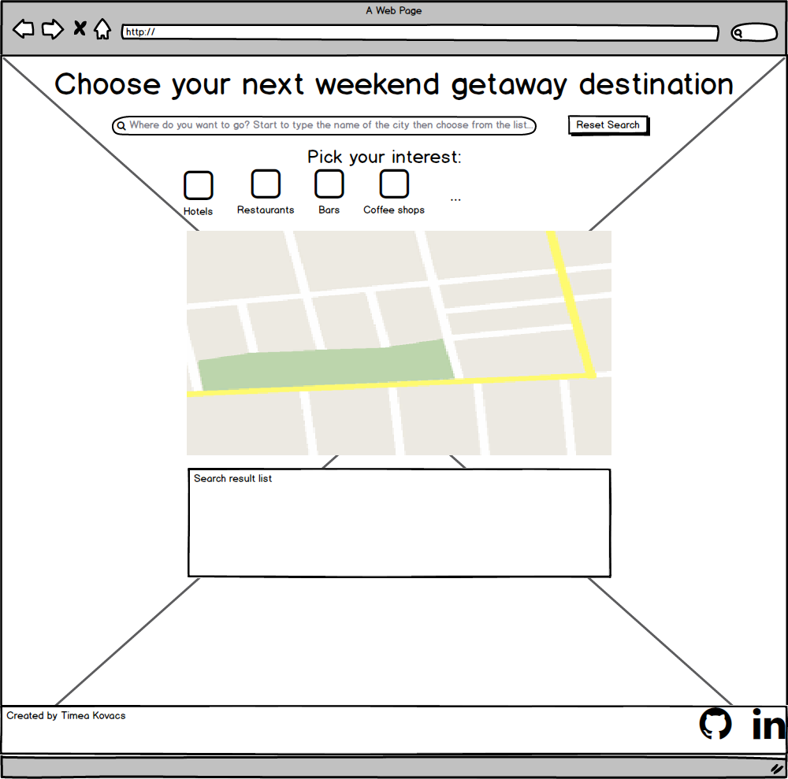
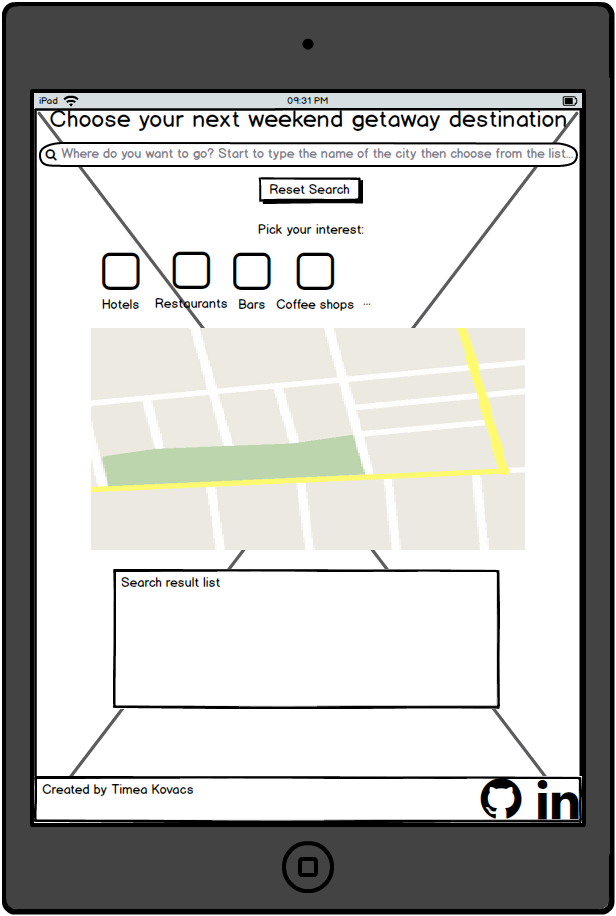

#Getaway Destination - Second Milestone Project
[View my project](https://timeakovacs86.github.io/Getawaydestination/)

This website is my second Milestone project at [Code Institute](https://codeinstitute.net/)
The main goal was to create a simple website which using the technologies that I got familiar with in the second phase and it's based on Java Script and its jQuery library and also on Google API libraries.
The website itself help us to find cities around the world and get back a list of restaurants, bars, coffee shops, museums and some other tourist attractions what would be useful, planning a vacation upfront.
We can see those places position on the map with markers to find them and plan the daily itinerary through the holiday around that area.
This is a single page website therefore very simple and easy to use, no need of any special technical skills to use it.
The results of our search is just one click away, it is also easy to use with one hand on our phones.

## UX

This website is created for everybody who wants to find a great weekend getaway destination.
I choose as a background picture the Fisherman's Bastion (Budapest, Hungary), because that's the city I am from, also I tried to use the background pictures colors, to ensure that this site has a user friendly and smooth surface.
The website is responsive, so it gives the same excellent user experience while you use it on a PC, tablet or mobile device with the same functionality.

### User Stories

#### Home page

- As a user, I want to get feedback is the searching field is empty.
- As a user, I want to find cities for vacation destination.
- As a user, I want to find restaurants around the searched city.
- As a user, I want to find bars around the searched city.
- As a user, I want to find coffee shops around the searched city.
- As a user, I want to find museums around the searched city.
- As a user, I want to see what kind of other opportunities I have as a tourist around the searched city.
- As a user, I want to see more result if there are more.
- As a user, I want to reset my search.

#### Responsive:

- As a user, I want to use the website on Pc, tablet and mobile phone so, it should work on different devices with the same functionality.

#### Effects:

- As a user, I want to see the hover effect on the buttons, interest icons and social media links as well, so I can see that there is an interaction with those elements.

#### Social links:

-As a user, I want to click on the social links so that it can be open is a new tab.

#### UI:

- In General:
    - Font:
        - I use "Amaranth" font, because it is easy and comfortable to read. I imported that font through the custom.css file from the google font repository.
    - Icons:
        - I use Font Awesome icon toolkit with he below mentioned icons:
            - Restaurant
            - Bar
            - Cafe
            - Museum
            - Information 
            - Facebook
            - Github
            - LinkedIn
    - Hover effects:
        - Search and reset search button
        - Filter section:
            - Restaurant icon
            - Bar icon
            - Coffee shop icon
            - Museum icon
            - Tourists attraction icon                
        - Social links:
            - Facebook icon
            - Github icon
            - LinkedIn icon 
- On the page I have implemented:
    - Input type:
        - "type=search", so in this way it became more straightforward and user friendly to type in the destinations.
    - Alert message is the search input field is empty     

- Mockup

    - **Created with [Balsamiq Mockups 3](https://balsamiq.com/) that is a user interface design tool**
    - **Getaway mockup desktop**:
        
    - **Getaway mockup ipad**:
        
    - **Getaway mochup iphone**:
        

## Features

With this page you can find  restaurants, bars, coffes shops, museums and other tourist attractions around that area that you give in the search field.
If you finished you search, you can reset the process with clicking on the reset button.

### Existing Features

- The main page:
    - Field checking:
        - If the input search field is empty and I click on one of the filter buttons, I get an alert message about that empty fiels
    - Icons:
        - To click on the Restaurant icon, you get back restaurants around the given city
        - To click on the Bar icon, you get back bars around the given city
        - To click on the Coffee shops icon, you get back coffee shops around the given city
        - To click on Museum icon, you get back museums around the given city
        - To click on Tourist attractions icon, you get back other tourist attractions around the given city
    - Button:
        - If in the first round we find more than 20 places the "More result" button become active
        - If there are no more results, the "More result" button become disabled
        - If there is no result around the area at all the "More result" button become disabled
        - I can reset the search with the reset button         
        
- Responsive:
    - The page is responsive, usable and looks good on the below resolution:
        - Phones less than 768px
        - Tablets 768px and Up
        - Desktops 992ox and Up
        - Large desktops 1200px and Up
        

## Technologies Used

- [HTML5](https://www.w3.org/html/)
    - Hypertext Markup Language is the standard markup language for creating web pages and web applications.
- [CSS3](https://www.w3.org/Style/CSS/)
    - Cascading Style Sheets is a style sheet language used for describing the presentation of a document written in a 
    markup language like HTML.
- [BootStrap 4.4.1](https://getbootstrap.com/docs/4.4/)
    - Front End Framework for developing responsive websites.
- [JavaScript](https://developer.mozilla.org/en-US/docs/Web/JavaScript)
    - JavaScript is a lightweight interpreted or just-in-time compiled programming language with first-class functions. While it is most well-known as the scripting language for Web pages.
- [JQuery 3.4.1](https://jquery.com)
    - The project uses to simplify DOM manipulation.
- [Git](https://git-scm.com/)
    - Git is a distributed version-control system for tracking changes in source code during software development.
- [GitHub](https://github.com/)
    -  GitHub Inc. is a web-based hosting service for version control using Git.
- [Google Maps JavaScript API](https://developers.google.com/maps/documentation/javascript/tutorial)
    - The Maps JavaScript API lets you customize maps with your own content.
    - Library used:
        - Google Places API
        
## Testing

Thanks to the "GitHub Pages" option on the GitHub website everybody can reach my website with clicking on the [link](https://timeakovacs86.github.io/Getawaydestination/)
I prefer the GitHub Pages option instead of the Cloud9 because it is stable and available 24/7.

**Test types:**
- Manual tests
    - Non-Functional tests
        - **Usability:** Usability testing is a technique used in user-centered interaction design to evaluate a product by testing it on users. 
        This can be seen as an irreplaceable usability practice, since it gives direct input on how real users use the system. 
        Shortly: The ease of use and learn to use the website
        - **Reliability:** Reliability testing is defined as a software testing type, that checks whether the software can 
        perform a failure-free operation for a specified period of time in a specified environment. 
            - Stable and consistent result
            - I will get the same result even if I search for the place on Pc, Tablet or Mobile Phone.
            - See test cases under the "Responsive" section 
- [HTML](https://validator.w3.org/) and [CSS](https://jigsaw.w3.org/css-validator/) validator:
    - With these validator I was ensured that after the scanning this code it does not shows me any detected errors.
    
### Testing the user stories:
#### Home Page:

- Scenario: As a user, I want to get feedback if the searching field is empty
    - I don't fill the search field and I click on he <filter_icon>. 
    - Alert message is appears.
    
|filter_icon|
|:---------:|
|Restaurants|
|Bars      |
|Coffee shops|
|Museums|
|Tourist attractions|

- Scenario: As a user, I want to find cities for holiday destinations
    - I type a holiday destination into the search field
    - I choose a city from the drop-down
    - I click on the <filter_icon>
    - I get back the city filtered by the <filter_icon>
    
|filter_icon|
|:---------:|
|Restaurants|
|Bars      |
|Coffee shops|
|Museums|
|Tourist attractions|

- As a user, I want to see the other opportunity around the city without type the city again
    - I type a holiday destination into the search field
    - I choose a city from the drop-down
    - I click on the <filter_icon>
    - I get back the city filtered by the<filter_icon>
    - I click another <filter_icon>
    - I get back <filter_icon> from the given city

|filter_icon|
|:---------:|
|Restaurants|
|Bars      |
|Coffee shops|
|Museums|
|Tourist attractions|

- Scenario: As a user, I want to find <sight> around the searched city
    - I type a holiday destination into the search field
    - I choose a city from the drop-down
    - I click one of the <sight>
    - I get back a list of <sight> in the given destination city

|sight      |
|:---------:|
|Restaurants|
|Bars      |
|Coffee shops|
|Museums|
|Tourist attractions|

- Scenario: As a user, I want to see more result if there are more
    - I type a holiday destination into the search field
    - I choose a city from the drop-down
    - I get back more result than 20
    - The More result button is active
    - I click on the More result button
    - Additional 20 places are appearing
    
- Scenario: As a user, I want to reset my search
    - I type a holiday destination into the search field
    - I choose a city from the drop-down
    - I get back the result
    - I click on the Reset button
    - The map and the result are disappear the search field became empty
    
#### Responsive:

- I grab the edge of the browser and modify the resolution. After this the website is still usable and looks good.
- Chrome developer tools: details below at the **Chrome Developer Tool** section
- I test the website with different devices (Pc, Tablet, Mobile phone)

#### Effects:

- Scenario: As a user I want to see the hover effects on the icons so that I can see there is interaction wih those elements.
    - I hover my mouse over the <icon> 
    - I can see the transition effect

|icon      |
|:--------:|
|Restaurants|
|Bars      |
|Coffee shops|
|Museums|
|Tourist attractions|
|Facebook |
|GitHub    |
|LinkedIn  | 

- Scenario: After clicking the filter icon the map direct to the map
    - I type a destination
    - I choose a destination
    - I click one of the filter button
    - The page will direct me to the map

#### Social links:

- I click on the <social_link> social link and the page will open in a new tab
        
|social_link|
|:---------:|
|Facebook     |
|GitHub     |
|LinkedIn   |

**Tested browsers:**
 - Chrome
 - Mozilla Firefox
 - Microsoft Edge

**Testing Tools:**
 - Chrome browser built-in developer tool
 - PC with full HD resolution (with real usage)
 - Mobile Phones: 
    - iPhone SE
    - Google Pixel 3
    - OnePlus 6T

**Chrome Developer Tool:**
- I made boundary testing on the edges where the resolution changed from:
    - Large desktop to desktop (Tested pixel width values: 1201px, 1200px, 1199px)
    - Desktop to tablet (Tested pixel width values: 993px, 992px, 991px)
    - Tablet to phone (Tested pixel width values: 769px, 768px, 767px)
- Console log error checking on the page during the testing
 
**Testing people:**
- Friends
- Myself

## Deployment

How I implement this project:

First I built the basic functionality one of my private repository until I get the first working version of the website. 
After this I copied the code snippets in this public repository, and explained the actual small pieces of the commits int he commit comment section.

 - **Set up**:
    - I use local IDe for create a project, I installed the Git locally and synchronized my local IDE with a local git. I use IntelliJ Pycharm for the front end development with its helpful built in deployment tools.
      After I created a Git and GitHub repository, I could start to work and I could test my features locally.
      I could see my changes locally by open my index.html file with a View/Open browser menu option in my local IDE.
      Here I could choose the required browser which I want to use. (Chrome, Mozzila, etc.)
 
 - **Commits**:
    - After every small piece of increment, I made a commit to my local Git repository. After that in the end of the bigger section that gives value to my project I pushed my modification to my online GitHub repository.
    
 - **Local and online deployment**:
    - Locally: it is very easy to clone repository from my account if you follow these steps:
        1. Follow this link [Project GitHub repository](https://github.com/TimeaKovacs86/Getawaydestination) 
        2. Under the repository name, click "Clone or download".
        3. Here you have to copy the url's of the repository
        4. In your local IDE you can choose to create new project from version control/Git 
        5. Paste the link there that you copied before
        6. For additional help you can more information under this [link](https://help.github.com/en/articles/cloning-a-repository) 
        
    - Online:
        - When there was a working increment after pushing it to my online GitHub repository I could test it online with real usage.
        For this I followed these steps:
            1. Under [my project GitHub directory](https://github.com/TimeaKovacs86/Getawaydestination) from the menu items I clicked on the Settings 
            2. Under the GitHub Pages section I could set up my online site from my master branch.
            3. After few minutes the online deployed site was available the given [link](https://timeakovacs86.github.io/Getawaydestination/)       
    

### Media

 - The photo used in this website were obtained from:
    - Wallpaper:
        - https://www.followmeaway.com/wp-content/uploads/2019/05/fishermans-bastion-view-from-large-turret.jpg    
    - Favicon:
        - https://www.google.com/url?sa=i&url=https%3A%2F%2Fthenounproject.com%2Fterm%2Fcompass%2F5796%2F&psig=AOvVaw2sBH2Bkfpq0cFrrbsSeYRV&ust=1582315878513000&source=images&cd=vfe&ved=0CAIQjRxqFwoTCNDS8Zj44OcCFQAAAAAdAAAAABAE    